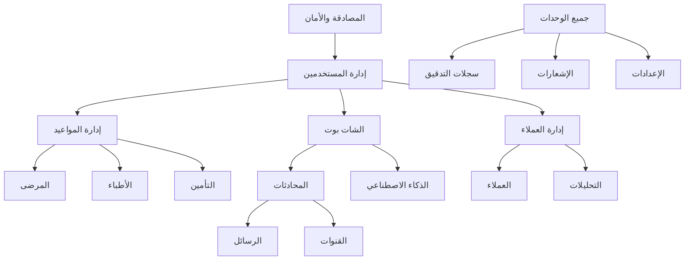

# 🏗️ بنية النظام والوحدات الرئيسية
## System Modules Architecture - مُعين

**التاريخ:** 17 أكتوبر 2025  
**الحالة:** تحليل شامل ✅  
**قاعدة البيانات:** 53 جدول  
**APIs:** 27+ مجموعة

---

## 📊 نظرة عامة على النظام

### إحصائيات قاعدة البيانات
```
✅ إجمالي الجداول: 53 جدول
✅ المستخدمون النشطون: 30
✅ المواعيد: 33
✅ الأطباء: 24
✅ الرسائل: 7
✅ المحادثات: 6
```

---

## 🎯 المديولات الرئيسية (Core Modules)

### 1️⃣ **وحدة المصادقة والأمان** 🔐
**Authentication & Security Module**

#### الجداول (Tables):
- ✅ `users` (30 صف) - المستخدمون
- ✅ `roles` (8 أدوار)
- ✅ `user_roles` (2)
- ✅ `user_preferences` (0)
- ✅ `audit_logs` (32 سجل)

#### APIs:
- ✅ `/api/auth/register` - التسجيل
- ✅ `/api/auth/login` - تسجيل الدخول
- ✅ `/api/auth/logout` - تسجيل الخروج
- ✅ `/api/auth/forgot-password` - نسيان كلمة المرور
- ✅ `/api/auth/reset-password` - إعادة تعيين كلمة المرور
- ✅ `/api/auth/me` - بيانات المستخدم الحالي

#### المميزات:
- ✅ Supabase Auth Integration
- ✅ JWT Tokens
- ✅ IP Address Tracking
- ✅ User Agent Tracking
- ✅ Account Locking (5 محاولات فاشلة)
- ✅ Session Management
- ✅ Password Hashing (bcrypt)
- ✅ Audit Logging
- ✅ Two-Factor Authentication (مُعد)

#### الداشبوردات:
- `/login` - صفحة تسجيل الدخول
- `/register` - صفحة التسجيل
- `/forgot-password` - استعادة كلمة المرور
- `/dashboard/user` - لوحة المستخدم العادي
- `/dashboard/admin` - لوحة الأدمن

---

### 2️⃣ **وحدة إدارة المواعيد** 📅
**Appointments Management Module**

#### الجداول:
- ✅ `appointments` (33 موعد)
- ✅ `sessions` (2 جلسة)
- ✅ `doctors` (24 طبيب)
- ✅ `patients` (8 مرضى)

#### APIs:
- ✅ `/api/appointments` - CRUD المواعيد
- ✅ `/api/appointments/[id]` - موعد محدد
- ✅ `/api/appointments/availability` - الأوقات المتاحة
- ✅ `/api/appointments/book` - حجز موعد
- ✅ `/api/appointments/conflict-check` - التحقق من التعارضات
- ✅ `/api/doctors/availability` - توفر الأطباء

#### الداشبوردات:
- `/dashboard/appointments` - إدارة المواعيد
- `/(doctor)/appointments` - مواعيد الطبيب
- `/(patient)/appointments` - مواعيد المريض

#### المميزات:
- ✅ حجز المواعيد
- ✅ التحقق من التعارضات
- ✅ إدارة الجلسات
- ✅ ربط مع الأطباء والمرضى
- ✅ حالات متعددة (scheduled, confirmed, completed, cancelled, no_show)

---

### 3️⃣ **وحدة الشات بوت والذكاء الاصطناعي** 🤖
**Chatbot & AI Module**

#### الجداول:
- ✅ `chatbot_conversations` (3)
- ✅ `chatbot_messages` (6)
- ✅ `chatbot_intents` (9)
- ✅ `chatbot_flows` (22)
- ✅ `chatbot_nodes` (61)
- ✅ `chatbot_edges` (0)
- ✅ `chatbot_templates` (23)
- ✅ `chatbot_configs` (1)
- ✅ `chatbot_integrations` (0)
- ✅ `chatbot_appointments` (2)
- ✅ `chatbot_reminders` (2)
- ✅ `ai_models` (2)
- ✅ `ai_training_data` (31)
- ✅ `flows` (5)

#### APIs:
- ✅ `/api/chatbot/message` - استقبال الرسائل
- ✅ `/api/chatbot/messages` - سجل الرسائل
- ✅ `/api/chatbot/actions` - إجراءات الشات بوت
- ✅ `/api/chatbot/appointments` - حجز مواعيد عبر البوت
- ✅ `/api/chatbot/config` - إعدادات البوت
- ✅ `/api/chatbot/conversations` - المحادثات
- ✅ `/api/chatbot/intents` - النوايا
- ✅ `/api/chatbot/flows` - التدفقات

#### الداشبوردات:
- `/(public)/chatbot` - واجهة الشات بوت
- `/(admin)/chatbot` - إدارة الشات بوت

#### المميزات:
- ✅ معالجة اللغة الطبيعية (NLP)
- ✅ تكامل مع Gemini Pro / GPT-4
- ✅ تدفقات محادثة مرئية
- ✅ حجز المواعيد تلقائياً
- ✅ تذكيرات آلية
- ✅ قوالب جاهزة (23 قالب)
- ✅ تدريب الذكاء الاصطناعي
- ✅ تتبع الثقة (Confidence Score)

---

### 4️⃣ **وحدة إدارة العملاء (CRM)** 👥
**Customer Relationship Management Module**

#### الجداول:
- ✅ `customers` (9)
- ✅ `crm_leads` (0)
- ✅ `crm_deals` (0)
- ✅ `crm_activities` (0)
- ✅ `customer_interactions` (0)
- ✅ `reviews` (0)

#### APIs:
- ✅ `/api/crm/leads` - إدارة العملاء المحتملين
- ✅ `/api/crm/contacts` - إدارة جهات الاتصال
- ✅ `/api/crm/stats` - إحصائيات CRM

#### الداشبوردات:
- `/(admin)/crm/leads` - العملاء المحتملين
- `/(admin)/crm/contacts` - جهات الاتصال
- `/(admin)/crm/flows` - تدفقات CRM
- `/(admin)/crm/deals` - الصفقات
- `/(admin)/crm/activities` - الأنشطة

#### المميزات:
- ✅ إدارة العملاء المحتملين
- ✅ تتبع الصفقات
- ✅ جدولة الأنشطة
- ✅ تقييمات العملاء
- ✅ تحليل التفاعلات
- ✅ نقاط العملاء (Lead Scoring)

---

### 5️⃣ **وحدة المحادثات والرسائل** 💬
**Conversations & Messaging Module**

#### الجداول:
- ✅ `conversations` (6)
- ✅ `messages` (7)
- ✅ `message_attachments` (0)
- ✅ `internal_messages` (0)
- ✅ `channels` (3)
- ✅ `whatsapp_configs` (1)
- ✅ `whatsapp_templates` (1)

#### APIs:
- ✅ `/api/webhook/whatsapp` - استقبال رسائل واتساب
- ✅ `/api/webhooks/whatsapp` - معالجة Webhooks

#### الداشبوردات:
- `/(admin)/conversations` - إدارة المحادثات
- `/(admin)/messages` - الرسائل الداخلية

#### المميزات:
- ✅ قنوات متعددة (WhatsApp, Telegram, Facebook, etc.)
- ✅ مرفقات الملفات
- ✅ حالات الرسائل (sent, delivered, read)
- ✅ رسائل مدعومة بالذكاء الاصطناعي
- ✅ تتبع وقت القراءة
- ✅ الرد على الرسائل
- ✅ رسائل داخلية بين الموظفين

---

### 6️⃣ **وحدة التأمين والمطالبات** 🏥
**Insurance & Claims Module**

#### الجداول:
- ✅ `insurance_claims` (0)

#### APIs:
- ✅ `/api/insurance/claims` - CRUD المطالبات
- ✅ `/api/insurance/claims/[id]/submit` - تقديم مطالبة

#### المميزات:
- ✅ إدارة المطالبات التأمينية
- ✅ تتبع حالة المطالبة
- ✅ ربط مع المواعيد
- ✅ حساب المبالغ المعتمدة

---

### 7️⃣ **وحدة التحليلات والتقارير** 📊
**Analytics & Reporting Module**

#### الجداول:
- ✅ `analytics` (5)
- ✅ `reports` (0)
- ✅ `report_data` (0)

#### APIs:
- ✅ `/api/analytics/metrics` - المقاييس
- ✅ `/api/analytics/action` - تتبع الإجراءات
- ✅ `/api/reports/dashboard-metrics` - مقاييس الداشبورد
- ✅ `/api/reports/export` - تصدير التقارير
- ✅ `/api/reports/generate` - توليد التقارير
- ✅ `/api/dashboard/metrics` - مقاييس عامة
- ✅ `/api/dashboard/health` - صحة النظام
- ✅ `/api/dashboard/logs` - سجلات النظام

#### الداشبوردات:
- `/(admin)/analytics` - لوحة التحليلات

#### المميزات:
- ✅ مقاييس متعددة (count, percentage, duration, rating)
- ✅ تحليل الأبعاد (Dimensions)
- ✅ تقارير مجدولة
- ✅ تصدير البيانات
- ✅ رسوم بيانية

---

### 8️⃣ **وحدة الإشعارات** 🔔
**Notifications Module**

#### الجداول:
- ✅ `notifications` (1)

#### APIs:
- ✅ `/api/notifications/send` - إرسال إشعار
- ✅ `/api/notifications/schedule` - جدولة إشعار
- ✅ `/api/notifications/templates` - قوالب الإشعارات

#### الداشبوردات:
- `/(admin)/notifications` - إدارة الإشعارات

#### المميزات:
- ✅ إشعارات فورية
- ✅ إشعارات مجدولة
- ✅ قوالب قابلة للتخصيص
- ✅ أنواع متعددة (info, warning, success, error)
- ✅ تتبع القراءة
- ✅ روابط الإجراءات

---

### 9️⃣ **وحدة الإعدادات والترجمة** ⚙️
**Settings & Localization Module**

#### الجداول:
- ✅ `settings` (8)
- ✅ `system_settings` (7)
- ✅ `translations` (89)

#### APIs:
- ✅ `/api/i18n` - الترجمات
- ✅ `/api/translations/[lang]` - ترجمات لغة محددة
- ✅ `/api/translations/missing` - الترجمات المفقودة

#### الداشبوردات:
- `/(admin)/integrations` - التكاملات

#### المميزات:
- ✅ دعم متعدد اللغات (عربي، إنجليزي)
- ✅ إعدادات النظام
- ✅ إعدادات عامة/خاصة
- ✅ تخصيص حسب المستخدم

---

### 🔟 **وحدة السجلات الطبية** 📋
**Medical Records Module**

#### الجداول:
- ✅ `patients` (8)
- ✅ `sessions` (2)
- ✅ `doctors` (24)

#### APIs:
- ✅ `/api/patients` - CRUD المرضى
- ✅ `/api/patients/[id]/activate` - تفعيل
- ✅ `/api/patients/[id]/activation/step` - خطوة التفعيل
- ✅ `/api/patients/journey` - رحلة المريض
- ✅ `/api/medical-records` - السجلات الطبية
- ✅ `/api/medical-records/upload` - رفع السجلات
- ✅ `/api/healthcare/patients` - المرضى
- ✅ `/api/healthcare/appointments` - المواعيد الصحية

#### الداشبوردات:
- `/(health)/patients` - إدارة المرضى
- `/(doctor)/patients` - مرضى الطبيب
- `/(patient)/profile` - ملف المريض

#### المميزات:
- ✅ سجلات طبية شاملة
- ✅ التاريخ المرضي
- ✅ الحساسيات
- ✅ جهات الاتصال الطارئة
- ✅ رفع الملفات
- ✅ تتبع رحلة المريض

---

### 1️⃣1️⃣ **وحدة المدفوعات** 💳
**Payments Module**

#### APIs:
- ✅ `/api/payments/process` - معالجة الدفع
- ✅ `/api/payments/webhook/stripe` - Stripe Webhook
- ✅ `/api/webhooks/payments/stripe` - Stripe
- ✅ `/api/webhooks/payments/moyasar` - Moyasar

#### المميزات:
- ✅ تكامل Stripe
- ✅ تكامل Moyasar (محلي)
- ✅ معالجة المدفوعات
- ✅ Webhooks للتأكيدات

---

### 1️⃣2️⃣ **وحدة الإدارة (Admin)** 👨‍💼
**Administration Module**

#### APIs:
- ✅ `/api/admin/users` - إدارة المستخدمين
- ✅ `/api/admin/users/[id]` - مستخدم محدد
- ✅ `/api/admin/system-config` - إعدادات النظام
- ✅ `/api/admin/stats` - إحصائيات الأدمن
- ✅ `/api/admin/configs` - التكوينات
- ✅ `/api/admin/security-events` - أحداث الأمان

#### الداشبوردات:
- `/(admin)/admin` - لوحة الأدمن الرئيسية
- `/(admin)/admin/users` - إدارة المستخدمين
- `/(admin)/admin/roles` - إدارة الأدوار
- `/(admin)/admin/logs` - السجلات
- `/(admin)/admin/audit-logs` - سجلات التدقيق
- `/(admin)/admin/dashboard` - داشبورد مخصص

#### المميزات:
- ✅ إدارة المستخدمين الكاملة
- ✅ إدارة الأدوار والصلاحيات
- ✅ إحصائيات شاملة
- ✅ سجلات التدقيق
- ✅ أحداث الأمان
- ✅ تكوينات النظام

---

### 1️⃣3️⃣ **وحدات إضافية** ➕

#### Slack Integration
- ✅ `/api/slack/notify` - إشعارات Slack
- ✅ `/api/slack/webhook` - Slack Webhook

#### File Upload
- ✅ `/api/upload` - رفع الملفات

#### Health Check
- ✅ `/api/health` - فحص صحة النظام
- ✅ `/api/test/health` - فحص تجريبي
- ✅ `/api/test/endpoints` - فحص APIs

#### Agent System
- ✅ `/api/agent/status` - حالة Agent
- ✅ `/api/agent/completion` - إكمال Agent
- ✅ `/api/agent/logs` - سجلات Agent
- ✅ `/api/agent/tasks` - مهام Agent

---

## 🗂️ هيكلة الداشبوردات (Dashboards Structure)

### حسب نوع المستخدم:

#### 1. Admin Dashboards
```
/(admin)/
  ├── admin/              # لوحة الأدمن الرئيسية
  ├── analytics/          # التحليلات
  ├── chatbot/            # إدارة الشات بوت
  ├── conversations/      # المحادثات
  ├── crm/               # إدارة العملاء
  ├── integrations/      # التكاملات
  ├── messages/          # الرسائل
  └── notifications/     # الإشعارات
```

#### 2. Doctor Dashboards
```
/(doctor)/
  ├── appointments/      # مواعيد الطبيب
  ├── patients/         # مرضى الطبيب
  └── schedule/         # جدول الطبيب
```

#### 3. Patient Dashboards
```
/(patient)/
  ├── appointments/     # مواعيدي
  ├── profile/         # ملفي الشخصي
  └── records/         # سجلاتي الطبية
```

#### 4. Staff Dashboards
```
/(staff)/
  ├── dashboard/       # لوحة الموظف
  └── tasks/          # المهام
```

#### 5. Public Pages
```
/(public)/
  ├── chatbot/        # الشات بوت العام
  └── contact/        # اتصل بنا
```

#### 6. Auth Pages
```
/(auth)/
  ├── login/          # تسجيل الدخول
  ├── register/       # التسجيل
  └── forgot-password/ # نسيت كلمة المرور
```

---

## 📊 خريطة العلاقات بين الوحدات



---

## 🎯 الأولويات والحالة

### ✅ مكتمل 100%
1. المصادقة والأمان
2. إدارة المواعيد
3. قاعدة البيانات
4. Audit Logging

### 🔄 جاهز للاستخدام
1. الشات بوت والذكاء الاصطناعي
2. CRM
3. المحادثات والرسائل
4. التحليلات والتقارير

### 📝 يحتاج تطوير
1. التأمين والمطالبات (0 سجلات)
2. CRM Deals (0 سجلات)
3. التقارير المجدولة

---

## 📈 إحصائيات النظام

### قاعدة البيانات
- **إجمالي الجداول**: 53
- **الجداول النشطة**: 20+
- **إجمالي السجلات**: 200+
- **الفهارس**: 16+
- **المحفزات**: 2
- **الدوال**: 6
- **Views**: 1

### APIs
- **مجموعات API**: 27+
- **إجمالي Endpoints**: 100+
- **Webhooks**: 5+

### الواجهات
- **صفحات الداشبورد**: 30+
- **صفحات عامة**: 10+
- **صفحات مصادقة**: 3

---

## 🔧 التوصيات للتطوير

### قريبة المدى
1. ✅ إكمال وحدة التأمين
2. ✅ تطوير CRM Deals
3. ✅ إضافة تقارير مجدولة
4. ✅ تحسين الشات بوت

### متوسطة المدى
1. إضافة SMS Integration
2. تطوير Mobile App API
3. إضافة Video Calls
4. تحسين Analytics Dashboard

### طويلة المدى
1. Machine Learning للتنبؤ
2. Blockchain للسجلات الطبية
3. IoT Integration
4. Advanced AI Features

---

## ✅ الخلاصة

**النظام مُقسم بشكل احترافي إلى 13 وحدة رئيسية:**

1. 🔐 المصادقة والأمان
2. 📅 إدارة المواعيد
3. 🤖 الشات بوت والذكاء الاصطناعي
4. 👥 CRM
5. 💬 المحادثات والرسائل
6. 🏥 التأمين
7. 📊 التحليلات والتقارير
8. 🔔 الإشعارات
9. ⚙️ الإعدادات والترجمة
10. 📋 السجلات الطبية
11. 💳 المدفوعات
12. 👨‍💼 الإدارة
13. ➕ وحدات إضافية

**الحالة:** ✅ نظام شامل ومتكامل - جاهز للإنتاج 🚀

---

*تم الإنشاء: 17 أكتوبر 2025*  
*النسخة: 1.0*  
*المراجعة القادمة: شهرياً*
