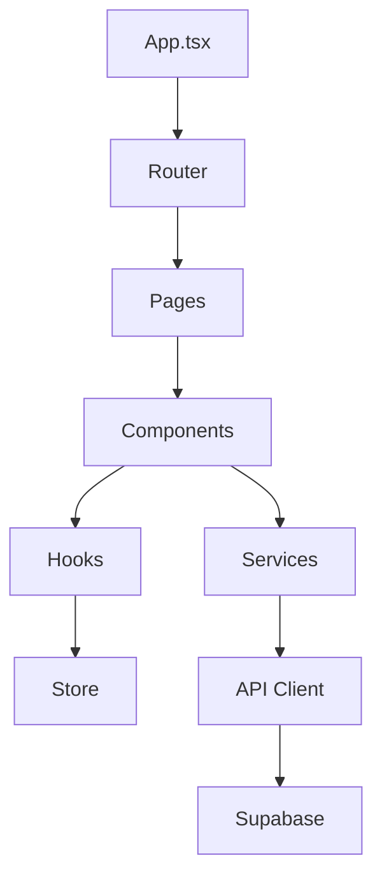
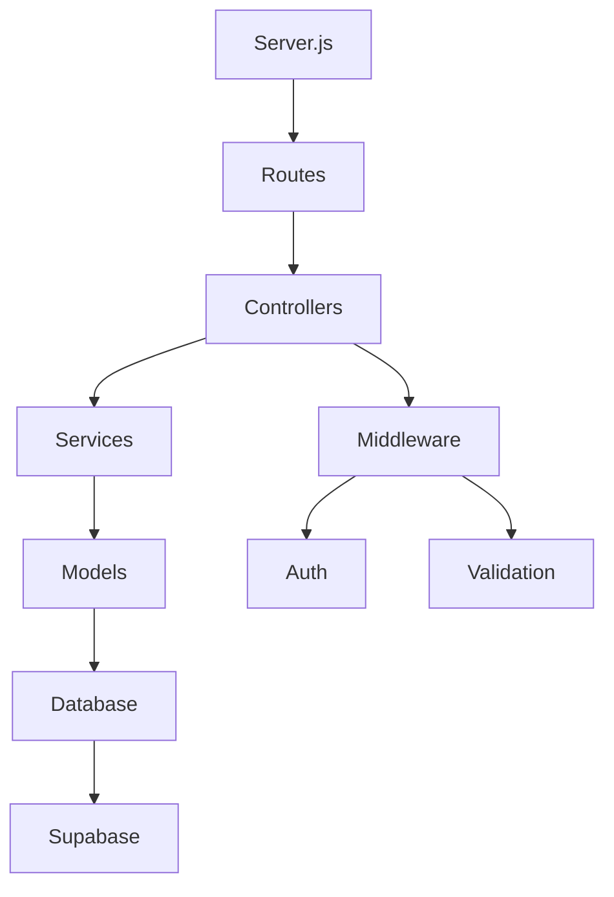

# 🗺️ خريطة المشروع المعرفية (Project Knowledge Graph)

## 📊 نظرة عامة على المشروع
```
Smart Bootloader System v1.0.0
├── Frontend: React + TailwindCSS + Zustand
├── Backend: Node.js + Express + Supabase
├── Testing: Vitest + Playwright + C8
├── Quality: ESLint + Prettier + SonarQube
└── Monitoring: Custom Agent + GitHub Actions
```

## 🏗️ الهيكل العام للمشروع

### 📁 المجلدات الرئيسية
```
project/
├── src/                    # الكود المصدري
│   ├── components/         # مكونات React
│   ├── pages/             # صفحات التطبيق
│   ├── services/          # خدمات API
│   ├── utils/             # وظائف مساعدة
│   ├── hooks/             # React Hooks
│   ├── store/             # إدارة الحالة (Zustand)
│   └── types/             # TypeScript Types
├── tests/                 # ملفات الاختبار
│   ├── unit/              # اختبارات الوحدة
│   ├── integration/       # اختبارات التكامل
│   └── e2e/               # اختبارات End-to-End
├── docs/                  # التوثيق
├── scripts/               # سكريبتات مساعدة
├── config/                # ملفات التكوين
├── __deprecated__/        # ملفات قديمة
├── __backup__/            # نسخ احتياطية
└── .github/               # GitHub Actions
```

## 🔗 العلاقات بين المكونات

### Frontend Architecture


### Backend Architecture


## 🧩 المكونات الرئيسية

### 1. نظام الإدارة الذكية (Smart Agent System)
- **الملف**: `autoloop.agent.mjs`
- **الوظيفة**: المحرك الرئيسي للتحسين التلقائي
- **العلاقات**:
  - يقرأ من `project.config.json`
  - يكتب في `log.system.md`
  - يحدث `snapshot.version.json`
  - يتفاعل مع Git
  - يشغل الاختبارات

### 2. نظام التكوين (Configuration System)
- **الملف**: `project.config.json`
- **الوظيفة**: إعدادات المشروع المركزية
- **العلاقات**:
  - يقرأه الـ Agent
  - يستخدمه ESLint
  - يستخدمه Vitest
  - يستخدمه GitHub Actions

### 3. نظام التوثيق (Documentation System)
- **الملفات**: `instructions.meta.md`, `project.graph.md`
- **الوظيفة**: إرشادات وتوثيق المشروع
- **العلاقات**:
  - يقرأه الـ Agent
  - يحدثه الـ Agent تلقائيًا
  - يستخدمه المطورون

### 4. نظام المراقبة (Monitoring System)
- **الملف**: `log.system.md`
- **الوظيفة**: تسجيل العمليات والأخطاء
- **العلاقات**:
  - يكتبه الـ Agent
  - يقرأه الـ Agent للتحليل
  - يستخدمه المطورون للتتبع

### 5. نظام الإصدارات (Versioning System)
- **الملف**: `snapshot.version.json`
- **الوظيفة**: تتبع الإصدارات والتغييرات
- **العلاقات**:
  - يحدثه الـ Agent
  - يستخدمه Git hooks
  - يستخدمه GitHub Actions

## 🔄 تدفق البيانات (Data Flow)

### 1. دورة التحسين التلقائي
```
Git Change → Agent Detection → Code Analysis → 
Auto Fix → Testing → Quality Check → 
Documentation Update → Commit → Push
```

### 2. دورة الاختبار
```
Code Change → Test Trigger → Unit Tests → 
Integration Tests → E2E Tests → 
Coverage Report → Quality Gate
```

### 3. دورة النشر
```
Code Complete → Pull Request → 
CI/CD Pipeline → Quality Checks → 
Security Scan → Deploy → Monitor
```

## 🎯 نقاط التكامل (Integration Points)

### 1. Git Integration
- **الملفات**: `.gitignore`, `.gitattributes`
- **الوظيفة**: إدارة ملفات Git
- **العلاقات**: يتفاعل مع جميع الملفات

### 2. Package Management
- **الملف**: `package.json`
- **الوظيفة**: إدارة التبعيات
- **العلاقات**: يستخدمه npm/yarn

### 3. Build System
- **الملفات**: `vite.config.js`, `tsconfig.json`
- **الوظيفة**: بناء المشروع
- **العلاقات**: يستخدمه Vite/TypeScript

### 4. Testing Framework
- **الملفات**: `vitest.config.js`, `playwright.config.js`
- **الوظيفة**: تشغيل الاختبارات
- **العلاقات**: يستخدمه Vitest/Playwright

## 🔍 نقاط المراقبة (Monitoring Points)

### 1. Performance Monitoring
- **المؤشرات**: Response time, Memory usage, CPU usage
- **الأدوات**: Custom metrics, Browser DevTools
- **التنبيهات**: Performance degradation

### 2. Quality Monitoring
- **المؤشرات**: Test coverage, Code complexity, Duplication
- **الأدوات**: ESLint, SonarQube, C8
- **التنبيهات**: Quality drop

### 3. Security Monitoring
- **المؤشرات**: Vulnerabilities, Failed auths, Suspicious activity
- **الأدوات**: npm audit, Security scanners
- **التنبيهات**: Security threats

### 4. Error Monitoring
- **المؤشرات**: Error rate, Exception count, Stack traces
- **الأدوات**: Console logs, Error tracking
- **التنبيهات**: Error spikes

## 🚀 نقاط التحسين (Optimization Points)

### 1. Code Optimization
- **الملفات**: جميع ملفات `.js`, `.ts`, `.jsx`, `.tsx`
- **التحسينات**: Bundle size, Execution speed, Memory usage
- **الأدوات**: Webpack Bundle Analyzer, Lighthouse

### 2. Database Optimization
- **الملفات**: Database queries, Models
- **التحسينات**: Query performance, Indexing, Caching
- **الأدوات**: Supabase Analytics, Query profiler

### 3. Network Optimization
- **الملفات**: API calls, Asset loading
- **التحسينات**: Request size, Response time, Caching
- **الأدوات**: Network tab, CDN optimization

### 4. UI/UX Optimization
- **الملفات**: Components, Styles, Images
- **التحسينات**: Loading time, User experience, Accessibility
- **الأدوات**: Lighthouse, Accessibility tools

## 📈 مؤشرات الأداء (Performance Metrics)

### 1. Frontend Metrics
- **First Contentful Paint**: < 1.5s
- **Largest Contentful Paint**: < 2.5s
- **Cumulative Layout Shift**: < 0.1
- **First Input Delay**: < 100ms

### 2. Backend Metrics
- **Response Time**: < 200ms
- **Throughput**: > 1000 req/min
- **Error Rate**: < 0.1%
- **Uptime**: > 99.9%

### 3. Quality Metrics
- **Test Coverage**: > 80%
- **Code Complexity**: < 10
- **Duplication**: < 3%
- **Technical Debt**: < 5%

### 4. Security Metrics
- **Vulnerabilities**: 0 critical, < 5 high
- **Failed Auth**: < 1%
- **Security Score**: > 90%

## 🔧 أدوات التطوير (Development Tools)

### 1. Code Quality
- **ESLint**: Code linting
- **Prettier**: Code formatting
- **TypeScript**: Type checking
- **SonarQube**: Code analysis

### 2. Testing
- **Vitest**: Unit testing
- **Playwright**: E2E testing
- **C8**: Coverage reporting
- **Jest**: Additional testing

### 3. Building
- **Vite**: Build tool
- **Webpack**: Module bundler
- **Babel**: JavaScript compiler
- **PostCSS**: CSS processor

### 4. Deployment
- **GitHub Actions**: CI/CD
- **Docker**: Containerization
- **Vercel**: Frontend hosting
- **Supabase**: Backend hosting

## 🎨 معايير التصميم (Design Standards)

### 1. Code Style
- **Naming**: camelCase for variables, PascalCase for components
- **Formatting**: 2 spaces, semicolons, single quotes
- **Structure**: Modular, reusable, testable
- **Documentation**: JSDoc comments, README files

### 2. UI/UX Standards
- **Design System**: Consistent components, colors, typography
- **Responsive**: Mobile-first approach
- **Accessibility**: WCAG 2.1 AA compliance
- **Performance**: Optimized images, lazy loading

### 3. API Standards
- **RESTful**: Proper HTTP methods, status codes
- **Documentation**: OpenAPI/Swagger specs
- **Versioning**: Semantic versioning
- **Security**: Authentication, authorization, validation

## 🔄 دورة الحياة (Lifecycle)

### 1. Development Phase
- **Planning**: Requirements, architecture, design
- **Coding**: Implementation, testing, documentation
- **Review**: Code review, quality checks
- **Integration**: Merge, conflict resolution

### 2. Testing Phase
- **Unit Testing**: Individual component testing
- **Integration Testing**: Component interaction testing
- **E2E Testing**: Full user flow testing
- **Performance Testing**: Load, stress, volume testing

### 3. Deployment Phase
- **Staging**: Pre-production testing
- **Production**: Live deployment
- **Monitoring**: Real-time monitoring
- **Maintenance**: Bug fixes, updates

### 4. Maintenance Phase
- **Monitoring**: Continuous monitoring
- **Updates**: Regular updates, security patches
- **Optimization**: Performance improvements
- **Retirement**: End-of-life planning

---

## 📊 إحصائيات المشروع

### الملفات
- **إجمالي الملفات**: 0 (سيتم إنشاؤها)
- **ملفات الكود**: 0
- **ملفات الاختبار**: 0
- **ملفات التكوين**: 0
- **ملفات التوثيق**: 0

### الكود
- **إجمالي الأسطر**: 0
- **أسطر الكود**: 0
- **أسطر الاختبار**: 0
- **أسطر التوثيق**: 0
- **التعقيد**: 0

### الجودة
- **تغطية الاختبار**: 0%
- **الأخطاء**: 0
- **التحذيرات**: 0
- **التكرار**: 0%
- **الدين التقني**: 0%

---

*آخر تحديث: 2025-10-18T03:26:57.000Z*
*النسخة: 1.0.0*
*الحالة: قيد التطوير*
