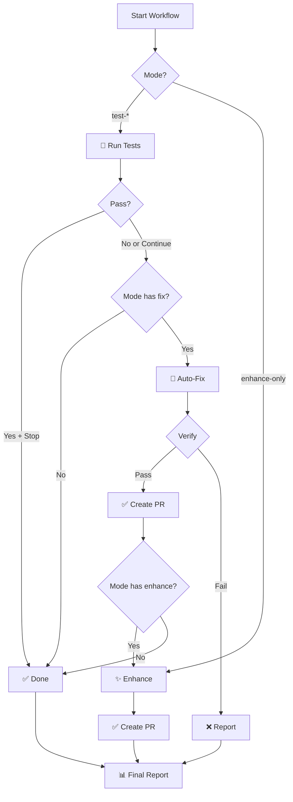

# 🤖 دليل Cursor Manual Workflow

## 📋 نظرة عامة

الـ workflow ده يشتغل **يدوياً** لما تبغى. بيوفرلك 4 أوضاع مختلفة حسب احتياجك.

## 🎯 الأوضاع المتاحة

### 1️⃣ `test-only` - فقط الاختبارات
```yaml
إيش يسوي؟
- يشغل Playwright tests
- يعرض النتائج
- ما يعدل شي

متى تستخدمه؟
✅ تشك في اختبار معين
✅ تبغى تتأكد كل شيء شغال
✅ قبل Merge
```

### 2️⃣ `test-and-fix` - اختبار + إصلاح
```yaml
إيش يسوي؟
- يشغل الاختبارات
- لو فشلت، يشغل Cursor Agent لإصلاحها
- ينشئ PR مع الإصلاحات

متى تستخدمه؟
✅ فيه اختبارات فاشلة
✅ تبغى إصلاح تلقائي
✅ ما عندك وقت للإصلاح اليدوي
```

### 3️⃣ `test-fix-enhance` - اختبار + إصلاح + تحسين
```yaml
إيش يسوي؟
- كل شيء في test-and-fix
- بعدين يحسّن الكود والاختبارات
- ينشئ PR للتحسينات

متى تستخدمه؟
✅ تبغى إصلاح + تحسين
✅ عندك وقت
✅ تبغى رفع جودة الكود
```

### 4️⃣ `enhance-only` - فقط التحسين
```yaml
إيش يسوي؟
- يشغل Cursor Agent للتحسينات
- ما يشغل الاختبارات
- ينشئ PR للتحسينات

متى تستخدمه؟
✅ كل الاختبارات شغالة
✅ تبغى تحسين فقط
✅ تبغى raise code quality
```

## 🚀 كيف تستخدمه؟

### من GitHub Web

1. روح Repository → **Actions**
2. اضغط **"🤖 Cursor Manual Workflow"**
3. اضغط **"Run workflow"**
4. املأ الإعدادات:
   - **Mode**: اختر الوضع المناسب
   - **Stop on Success**: `true` أو `false`
   - **Model**: اختر AI Model
5. اضغط **"Run workflow"** الأخضر

### من Terminal

```bash
# اختبار فقط
gh workflow run cursor-manual-workflow.yml \
  -f mode="test-only" \
  -f stop_on_success="true" \
  -f model="claude-sonnet-4"

# اختبار + إصلاح
gh workflow run cursor-manual-workflow.yml \
  -f mode="test-and-fix" \
  -f stop_on_success="false" \
  -f model="gpt-4o"

# اختبار + إصلاح + تحسين
gh workflow run cursor-manual-workflow.yml \
  -f mode="test-fix-enhance" \
  -f stop_on_success="false" \
  -f model="claude-sonnet-4"

# تحسين فقط
gh workflow run cursor-manual-workflow.yml \
  -f mode="enhance-only" \
  -f model="claude-sonnet-4"
```

## ⚙️ الإعدادات المطلوبة

### GitHub Secrets
يجب إضافة Secret التالي:
- `CURSOR_API_KEY` - من Cursor Dashboard

### كيفية إضافة Secret
1. روح Repository → **Settings**
2. اضغط **Secrets and variables** → **Actions**
3. اضغط تبويب **Secrets**
4. اضغط **New repository secret**
5. املأ الاسم والقيمة

## 📊 كيف يعمل؟



## 🎯 أمثلة استخدام

### مثال 1: فحص سريع
```bash
# شغل الاختبارات فقط
gh workflow run cursor-manual-workflow.yml -f mode="test-only" -f stop_on_success="true"
```

### مثال 2: إصلاح تلقائي
```bash
# لو فيه اختبارات فاشلة، أصلحها تلقائياً
gh workflow run cursor-manual-workflow.yml -f mode="test-and-fix" -f stop_on_success="false"
```

### مثال 3: تحسين شامل
```bash
# إصلاح + تحسين الكود
gh workflow run cursor-manual-workflow.yml -f mode="test-fix-enhance" -f stop_on_success="false"
```

### مثال 4: تحسين فقط
```bash
# حسّن الكود بدون اختبار
gh workflow run cursor-manual-workflow.yml -f mode="enhance-only"
```

## 🛡️ القواعد والأمان

### ما الـ Agent يعدله:
✅ `src/**/*`
✅ `tests/**/*`
✅ `e2e/**/*`
✅ `components/**/*`
✅ `lib/**/*`

### ما الـ Agent ما يعدله:
❌ `package.json`
❌ `package-lock.json`
❌ Workflows (`.github/workflows/*.yml`)
❌ Config files خارج `src/`

### الـ Agent ما يسوي:
❌ `git commit` مباشر
❌ `git push` للـ main
❌ تعطيل الاختبارات
❌ حذف ملفات مهمة

## 📊 الـ Models المتاحة

| Model | السرعة | الجودة | متى تستخدمه؟ |
|-------|--------|--------|---------------|
| `claude-sonnet-4` | ⭐⭐⭐ | ⭐⭐⭐⭐⭐ | إصلاحات معقدة |
| `gpt-4o` | ⭐⭐⭐⭐ | ⭐⭐⭐⭐ | إصلاحات عادية |
| `gpt-4-turbo` | ⭐⭐⭐⭐⭐ | ⭐⭐⭐⭐ | إصلاحات سريعة |

## 🔗 روابط مفيدة

- [Workflow Runs](https://github.com/ascespade/moeen/actions/workflows/cursor-manual-workflow.yml)
- [Cursor Dashboard](https://cursor.com/dashboard?tab=background-agents)
- [GitHub Actions Docs](https://docs.github.com/en/actions)

## 💡 نصائح

1. **استخدم `test-only`** قبل الـ merge للتأكد
2. **استخدم `test-and-fix`** للاختبارات الفاشلة المستعصية
3. **استخدم `test-fix-enhance`** يوم الجمعة للتحسينات
4. **استخدم `enhance-only`** لما تبغى تحسين الكود فقط

## ⚠️ تحذيرات

- الـ Agent قد يأخذ وقت (5-15 دقيقة)
- اترك الـ workflow يكمل حتى النهاية
- راجع الـ PR قبل الـ merge
- لا تشغل workflow متعددة بنفس الوقت

## 🎉 جاهز؟

ابدأ الآن:
```bash
gh workflow run cursor-manual-workflow.yml
```

---

**تم بواسطة:** Cursor Agent 🤖  
**آخر تحديث:** اليوم  
**الإصدار:** 1.0.0

