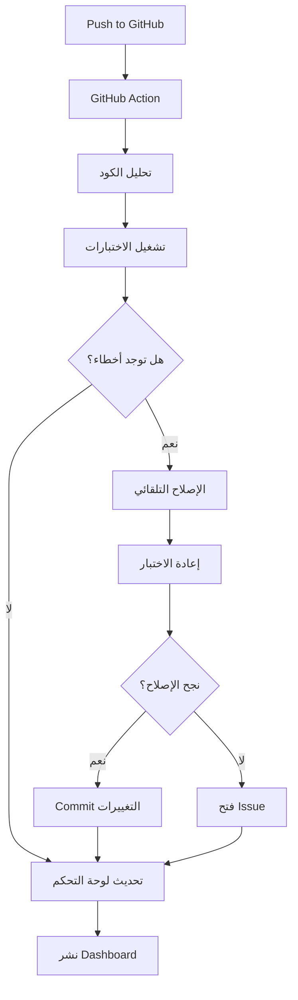

# 🤖 AI Self-Healing CI/CD System v3.0 - دليل شامل

## 📋 نظرة عامة

نظام متكامل للإصلاح الذاتي والتحسين التلقائي للكود باستخدام الذكاء الاصطناعي، مع لوحة مراقبة تفاعلية ونظام تسجيل متقدم.

## ✨ الميزات الرئيسية

### 🔧 الإصلاح التلقائي
- إصلاح أخطاء ESLint تلقائياً
- حل مشاكل TypeScript
- إصلاح الاختبارات الفاشلة
- تحسين الأداء والجودة

### 🧪 الاختبارات الشاملة
- اختبارات الوحدة (Unit Tests)
- اختبارات التكامل (Integration Tests)
- اختبارات E2E (End-to-End)
- اختبارات Playwright
- اختبارات Supawright

### 📊 لوحة المراقبة
- إحصائيات شاملة في الوقت الفعلي
- رسوم بيانية تفاعلية
- سجل مفصل لجميع العمليات
- بحث وتصفية متقدم

### 💾 نظام النسخ الاحتياطي
- نسخ احتياطي تلقائي قبل أي تعديل
- حفظ البيانات الوصفية
- استعادة سهلة للنسخ القديمة

### 🔍 نظام المراقبة
- مراقبة استخدام الموارد
- تتبع صحة المشروع
- تنبيهات تلقائية
- تقارير HTML مفصلة

## 🚀 التثبيت والإعداد

### 1. المتطلبات الأساسية

```bash
Node.js >= 18
npm >= 8
Git
```

### 2. تثبيت التبعيات

```bash
npm install
```

### 3. إعداد المتغيرات البيئية

انسخ ملف `env.example` إلى `.env` وقم بتعديل القيم:

```bash
cp env.example .env
```

المتغيرات المطلوبة:

```env
# Cursor Background Agent
CURSOR_API_KEY=your_cursor_api_key_here
LLM_PROVIDER=cursor

# Supabase
NEXT_PUBLIC_SUPABASE_URL=your_supabase_url_here
NEXT_PUBLIC_SUPABASE_ANON_KEY=your_supabase_anon_key_here
SUPABASE_SERVICE_ROLE_KEY=your_supabase_service_role_key_here

# GitHub
GITHUB_TOKEN=your_github_token_here

# Optional: OpenAI
OPENAI_API_KEY=your_openai_api_key_here

# Optional: Ollama
OLLAMA_URL=http://localhost:11434
```

### 4. إعداد GitHub Secrets

أضف المتغيرات التالية في GitHub Secrets:

- `NEXT_PUBLIC_SUPABASE_URL`
- `NEXT_PUBLIC_SUPABASE_ANON_KEY`
- `SUPABASE_SERVICE_ROLE_KEY`
- `CURSOR_API_KEY`
- `GITHUB_TOKEN`

### 5. تفعيل GitHub Pages

1. اذهب إلى Settings → Pages
2. اختر Source: `gh-pages` branch
3. احفظ التغييرات

## 📖 الاستخدام

### أوامر الوكيل الذكي

```bash
# وضع تلقائي
npm run agent:auto

# وضع Cursor
npm run agent:cursor

# وضع OpenAI
npm run agent:openai

# وضع Ollama
npm run agent:ollama

# إصلاح فقط
npm run agent:fix

# اختبار فقط
npm run agent:test

# تحسين فقط
npm run agent:optimize

# إعادة هيكلة
npm run agent:refactor

# وضع الخلفية
npm run agent:background

# وضع المراقبة
npm run agent:monitor

# إصلاح شامل
npm run agent:heal
```

### أوامر الاختبارات

```bash
# جميع الاختبارات
npm run test:full-suite

# اختبارات الوحدة
npm run test:unit

# اختبارات التكامل
npm run test:integration

# اختبارات E2E
npm run test:e2e

# اختبارات شاملة
npm run test:comprehensive

# تغطية الاختبارات
npm run test:coverage
```

### أوامر النسخ الاحتياطي

```bash
# إنشاء نسخة احتياطية
npm run backup:create

# استعادة نسخة احتياطية
npm run backup:restore <path>

# عرض النسخ المتاحة
npm run backup:list

# تنظيف النسخ القديمة
npm run backup:clean
```

### أوامر المراقبة

```bash
# إنشاء تقرير
npm run monitor:report

# بدء المراقبة المستمرة
npm run monitor:start

# عرض مقاييس النظام
npm run monitor:metrics

# فحص صحة المشروع
npm run monitor:health
```

### أوامر الجودة

```bash
# فحص ESLint
npm run lint:check

# إصلاح ESLint
npm run lint:fix

# فحص TypeScript
npm run type:check

# تنسيق الكود
npm run format

# فحص الأمان
npm run security:audit

# إصلاح الأمان
npm run security:fix
```

## 🏗️ البنية المعمارية

```
/project-root
│
├── .github/workflows/
│   ├── ai-self-healing.yml       # الـ workflow الرئيسي
│   ├── ai-call-cursor-agent.yml  # استدعاء Cursor Agent
│   └── update-dashboard.yml      # تحديث لوحة التحكم
│
├── scripts/
│   ├── ai_self_test_and_fix.mjs  # السكريبت الرئيسي
│   ├── ai-logger.mjs              # نظام التسجيل
│   ├── backup-system.mjs          # نظام النسخ الاحتياطي
│   ├── monitoring-system.mjs      # نظام المراقبة
│   ├── run-comprehensive-tests.mjs # الاختبارات الشاملة
│   └── setup-environment.sh       # إعداد البيئة
│
├── dashboard/
│   ├── index.html                 # الصفحة الرئيسية
│   ├── style.css                  # التنسيقات
│   ├── script.js                  # البرمجة
│   └── logs.json                  # البيانات (يتم توليده تلقائياً)
│
├── tests/comprehensive/
│   ├── frontend.spec.js           # اختبارات الواجهة
│   ├── api.spec.js                # اختبارات API
│   └── database.spec.js           # اختبارات قاعدة البيانات
│
├── reports/
│   ├── backups/                   # النسخ الاحتياطية
│   ├── monitoring/                # تقارير المراقبة
│   ├── test-results/              # نتائج الاختبارات
│   ├── ai-report.md               # التقرير الرئيسي
│   └── final_summary.md           # الملخص النهائي
│
├── logs/
│   ├── ai-agent.log               # سجل الوكيل
│   ├── monitoring.log             # سجل المراقبة
│   └── comprehensive-tests.log    # سجل الاختبارات
│
├── cursor.agent.json              # تكوين Cursor Agent
├── ai_logs.db                     # قاعدة بيانات السجلات
├── env.example                    # مثال للمتغيرات البيئية
└── AI_SYSTEM_README.md            # هذا الملف
```

## 🔄 سير العمل

### 1. عند كل Commit/Push



### 2. الإصلاح التلقائي

1. **التحليل**: فحص الكود بحثاً عن أخطاء
2. **النسخ الاحتياطي**: حفظ نسخة من الملفات
3. **الإصلاح**: تطبيق الإصلاحات التلقائية
4. **الاختبار**: التحقق من نجاح الإصلاحات
5. **التسجيل**: حفظ النتائج في قاعدة البيانات
6. **التقرير**: إنشاء تقرير مفصل

## 📊 لوحة التحكم

### الوصول

بعد تفعيل GitHub Pages، يمكنك الوصول إلى اللوحة عبر:

```
https://your-username.github.io/your-repo-name/
```

### الميزات

- **إحصائيات فورية**: عدد العمليات الناجحة/الفاشلة، متوسط الجودة، إجمالي الأسطر المعدلة
- **رسوم بيانية**: تطور الجودة ومدة التنفيذ مع الزمن
- **جدول السجلات**: سجل مفصل لجميع العمليات مع إمكانية البحث والتصفية
- **تحديث تلقائي**: تحديث البيانات كل 15 ثانية

## 🔧 التخصيص

### تعديل عدد الدورات

في `scripts/ai_self_test_and_fix.mjs`:

```javascript
const MAX_CYCLES = 10; // غير هذا الرقم
```

### تعديل مدة الانتظار

```javascript
const CYCLE_DELAY_SECONDS = 5; // غير هذا الرقم
```

### تعديل مزود LLM

في `.env`:

```env
LLM_PROVIDER=cursor  # أو openai أو ollama
```

## 🐛 استكشاف الأخطاء

### مشكلة: لا تظهر البيانات في Dashboard

**الحل:**
1. تأكد من تشغيل `npm run agent:auto` مرة واحدة على الأقل
2. تحقق من وجود ملف `ai_logs.db`
3. قم بتشغيل `node scripts/ai-logger.mjs export`

### مشكلة: فشل GitHub Action

**الحل:**
1. تحقق من إضافة جميع Secrets المطلوبة
2. راجع سجلات الـ Action في GitHub
3. تأكد من صلاحيات الـ GITHUB_TOKEN

### مشكلة: فشل الاختبارات

**الحل:**
1. قم بتشغيل `npm run test:unit` محلياً
2. راجع سجلات الاختبارات في `logs/`
3. قم بتشغيل `npm run agent:fix` لإصلاح الأخطاء

## 📚 الموارد الإضافية

- [دليل Cursor Background Agent](./CURSOR_AGENT_GUIDE.md)
- [وثائق GitHub Actions](https://docs.github.com/en/actions)
- [وثائق Playwright](https://playwright.dev/)
- [وثائق Supabase](https://supabase.com/docs)

## 🤝 المساهمة

نرحب بالمساهمات! يرجى:

1. Fork المشروع
2. إنشاء فرع جديد (`git checkout -b feature/amazing-feature`)
3. Commit التغييرات (`git commit -m 'Add amazing feature'`)
4. Push إلى الفرع (`git push origin feature/amazing-feature`)
5. فتح Pull Request

## 📄 الترخيص

هذا المشروع مرخص تحت MIT License.

## 📞 الدعم

للحصول على المساعدة:

1. راجع السجلات في `logs/`
2. فحص التقارير في `reports/`
3. مراجعة GitHub Actions logs
4. فحص Cursor Background Agent logs

---

*تم إنشاء هذا النظام بواسطة AI Self-Healing CI/CD v3.0* 🤖
