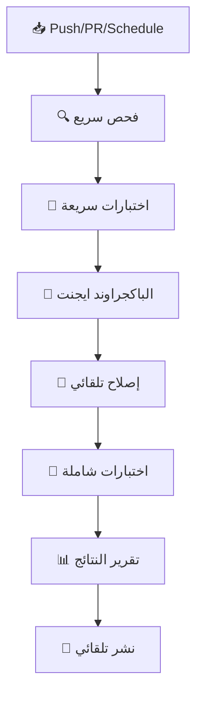

# 🤖 سيناريو النظام الجديد: AI Self-Healing CI/CD v3.0

## 📋 نظرة عامة

النظام الجديد يعمل كـ **AI Background Agent** ذكي يقوم بـ:
- **مراقبة مستمرة** للمشروع
- **إصلاح تلقائي** للمشاكل
- **تحسين مستمر** للأداء
- **اختبار شامل** للكود
- **نشر تلقائي** عند النجاح

---

## 🔄 دورة العمل الكاملة

### 1️⃣ **المرحلة الأولى: المراقبة المستمرة**



### 2️⃣ **المرحلة الثانية: الباكجراوند ايجنت**

#### **🎯 المهام الرئيسية:**

1. **تحليل الكود:**
   - فحص ESLint errors
   - فحص TypeScript errors
   - فحص security issues
   - تحليل جودة الكود

2. **إصلاح تلقائي:**
   - إصلاح ESLint errors
   - إصلاح TypeScript errors
   - إصلاح الاختبارات
   - تحسين الأداء

3. **اختبار شامل:**
   - Unit tests
   - Integration tests
   - E2E tests
   - Performance tests

4. **تحسين مستمر:**
   - تحسين الكود
   - تحسين الأداء
   - تحسين الأمان
   - تحسين التوثيق

---

## 🚀 سيناريوهات التشغيل

### **سيناريو 1: Push عادي**

```bash
# 1. المطور يدفع كود جديد
git push origin main

# 2. GitHub Actions يبدأ العمل
# 3. فحص سريع (5 دقائق)
# 4. اختبارات سريعة (10 دقائق)
# 5. الباكجراوند ايجنت (30 دقيقة)
# 6. إصلاح تلقائي (15 دقيقة)
# 7. اختبارات شاملة (20 دقيقة)
# 8. تقرير النتائج
# 9. نشر تلقائي (إذا نجح كل شيء)
```

### **سيناريو 2: Pull Request**

```bash
# 1. المطور يفتح PR
# 2. فحص سريع
# 3. اختبارات سريعة
# 4. الباكجراوند ايجنت
# 5. تقرير النتائج
# 6. تعليق على PR بالنتائج
```

### **سيناريو 3: Schedule (كل 4 ساعات)**

```bash
# 1. تشغيل تلقائي كل 4 ساعات
# 2. فحص شامل للمشروع
# 3. إصلاح المشاكل المكتشفة
# 4. تحسين الأداء
# 5. تحديث التقارير
# 6. إشعار الفريق بالنتائج
```

### **سيناريو 4: Manual Trigger**

```bash
# 1. المطور يختار وضع التشغيل:
#    - auto: وضع تلقائي
#    - fix-only: إصلاح فقط
#    - test-only: اختبار فقط
#    - optimize-only: تحسين فقط
#    - refactor: إعادة هيكلة
#    - background-agent: باكجراوند ايجنت فقط

# 2. النظام ينفذ المهمة المطلوبة
# 3. تقرير النتائج
```

---

## 🎯 الميزات الجديدة

### **1. الباكجراوند ايجنت الذكي**

```javascript
// مثال على كيفية عمل الباكجراوند ايجنت
const backgroundAgent = {
  // مراقبة مستمرة
  watch: true,
  
  // إصلاح تلقائي
  autoFix: true,
  
  // اختبار مستمر
  continuousTesting: true,
  
  // تحسين مستمر
  continuousOptimization: true,
  
  // تقارير ذكية
  smartReporting: true
}
```

### **2. الإصلاح التلقائي**

```bash
# الباكجراوند ايجنت يصلح المشاكل تلقائياً:
- ESLint errors → npm run lint:fix
- TypeScript errors → tsc --noEmit
- Test failures → npm run test:unit
- Security issues → npm audit fix
- Performance issues → تحسين الكود
```

### **3. الاختبارات الذكية**

```bash
# اختبارات متدرجة:
1. اختبارات سريعة (5-10 دقائق)
2. اختبارات شاملة (15-20 دقيقة)
3. اختبارات E2E (10-15 دقيقة)
4. اختبارات الأداء (5-10 دقائق)
```

### **4. التقارير الذكية**

```markdown
## 🤖 AI Self-Healing CI/CD v3.0 Report

### 📅 التاريخ: 2025-01-18 10:30:00
### 🔄 الدورة: #123
### 🌿 الفرع: main
### 🎯 الوضع: auto

### ✅ النتائج:
- فحص سريع: ✅ success
- اختبارات سريعة: ✅ success
- الباكجراوند ايجنت: ✅ success
- الإصلاح التلقائي: ℹ️ not needed
- اختبارات شاملة: ✅ success

### 🎯 التوصيات:
- ✅ الباكجراوند ايجنت يعمل بشكل مثالي
- ℹ️ لا توجد مشاكل تحتاج إصلاح تلقائي
```

---

## 🔧 إعداد النظام

### **1. متطلبات البيئة**

```bash
# متغيرات البيئة المطلوبة:
CURSOR_API_KEY=your_cursor_api_key
SUPABASE_URL=your_supabase_url
SUPABASE_ANON_KEY=your_supabase_anon_key
GITHUB_TOKEN=your_github_token
```

### **2. إعداد GitHub Secrets**

```bash
# في GitHub Repository Settings > Secrets:
1. CURSOR_API_KEY
2. SUPABASE_URL
3. SUPABASE_ANON_KEY
4. GITHUB_TOKEN (auto-generated)
```

### **3. إعداد الباكجراوند ايجنت**

```bash
# في Cursor Background Agent Settings:
1. تفعيل الباكجراوند ايجنت
2. إضافة CURSOR_API_KEY
3. إضافة SUPABASE_URL
4. إضافة SUPABASE_ANON_KEY
5. تفعيل المراقبة المستمرة
```

---

## 📊 مراقبة الأداء

### **1. مؤشرات الأداء**

- **وقت الاستجابة:** < 5 دقائق للفحص السريع
- **وقت الإصلاح:** < 15 دقيقة للإصلاح التلقائي
- **وقت الاختبار:** < 20 دقيقة للاختبارات الشاملة
- **معدل النجاح:** > 95% للاختبارات
- **معدل الإصلاح:** > 90% للمشاكل المكتشفة

### **2. التقارير**

- **تقرير يومي:** ملخص الأداء اليومي
- **تقرير أسبوعي:** تحليل الاتجاهات
- **تقرير شهري:** تقييم شامل للنظام
- **تقرير فوري:** عند حدوث مشاكل

### **3. التنبيهات**

- **نجاح:** إشعار عند نجاح العملية
- **فشل:** إشعار عند فشل العملية
- **مشاكل:** إشعار عند اكتشاف مشاكل جديدة
- **تحسينات:** إشعار عند تحسين الأداء

---

## 🎯 الفوائد المتوقعة

### **1. للمطورين**

- **توفير الوقت:** إصلاح تلقائي للمشاكل
- **جودة أعلى:** اختبارات شاملة مستمرة
- **أداء أفضل:** تحسين مستمر للأداء
- **أمان أكبر:** فحص أمني مستمر

### **2. للمشروع**

- **استقرار أكبر:** إصلاح المشاكل قبل انتشارها
- **جودة أعلى:** اختبارات شاملة مستمرة
- **أداء أفضل:** تحسين مستمر للأداء
- **توثيق أفضل:** تحديث مستمر للتوثيق

### **3. للفريق**

- **تعاون أفضل:** تقارير واضحة للجميع
- **شفافية أكبر:** رؤية واضحة لحالة المشروع
- **ثقة أكبر:** نظام موثوق ومستقر
- **إنتاجية أعلى:** تركيز على المهام المهمة

---

## 🚀 الخلاصة

النظام الجديد **AI Self-Healing CI/CD v3.0** يوفر:

1. **مراقبة مستمرة** للمشروع
2. **إصلاح تلقائي** للمشاكل
3. **اختبار شامل** للكود
4. **تحسين مستمر** للأداء
5. **نشر تلقائي** عند النجاح
6. **تقارير ذكية** للفريق

**النتيجة:** مشروع مستقر، آمن، عالي الجودة، مع أداء ممتاز! 🎯
