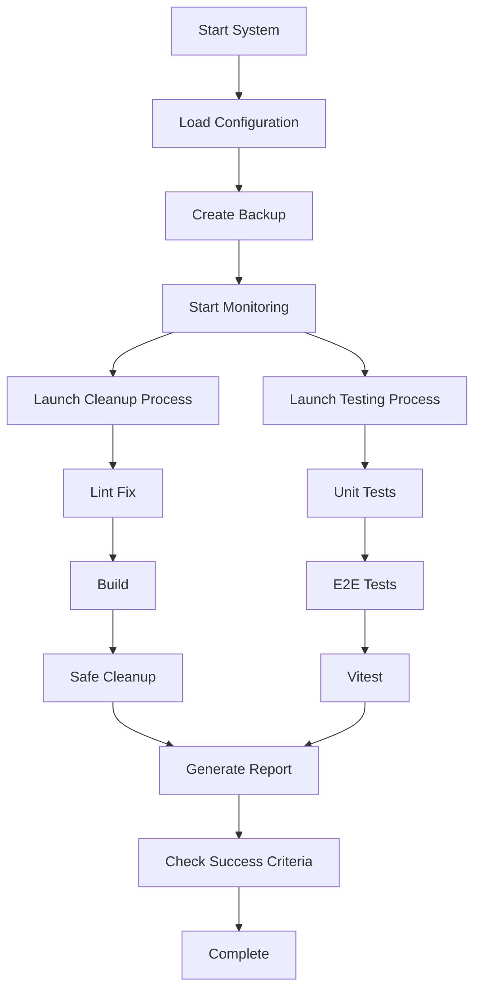

# NextJS Smart Dual-Thread Cleaner & Tester

🚀 **Aggressive AI agent that runs parallel cleanup and full testing with zero stalling.**

## Overview

This system provides a robust, parallel execution environment for NextJS projects that runs cleanup and testing processes concurrently, ensuring maximum efficiency and system stability.

## Features

### 🔄 Parallel Execution
- **Dual-thread architecture** with aggressive concurrency
- **Zero stalling** with intelligent process management
- **Auto-restart on idle** recovery mechanism
- **Maximum CPU utilization** for optimal performance

### 🧹 Cleanup Process
- **Lint fixing** with automatic error correction
- **Build validation** to ensure project stability
- **Safe cleanup** of temporary files and build artifacts
- **Configurable steps** with timeout and retry options

### 🧪 Testing Process
- **Unit tests** with Vitest integration
- **E2E tests** with Playwright support
- **Fallback mechanisms** for test failures
- **Continue on error** for non-critical test failures

### 📊 Monitoring & Recovery
- **Real-time status** updates with progress bars
- **Auto-retry** with exponential backoff
- **Comprehensive error handling** and logging
- **System backup** before execution
- **Rollback capability** on critical failures

## Quick Start

### Installation
The system is already integrated into your NextJS project. No additional installation required.

### Basic Usage

```bash
# Run the complete dual-thread system
npm run dual:run

# Run individual components
npm run dual:cleanup  # Cleanup only
npm run dual:test     # Testing only
npm run dual:monitor  # Monitor mode
```

### Configuration

The system uses `dual-thread-config.json` for configuration:

```json
{
  "parallelExecution": {
    "enabled": true,
    "threads": 2,
    "mode": "aggressive"
  },
  "cleanupProcess": {
    "enabled": true,
    "steps": [
      {
        "name": "lint-fix",
        "command": "npm run lint:fix",
        "timeout": 300000,
        "retryOnFailure": true
      }
    ]
  },
  "testingProcess": {
    "enabled": true,
    "steps": [
      {
        "name": "unit-tests",
        "command": "npm run test:unit",
        "timeout": 300000,
        "continueOnError": true
      }
    ]
  }
}
```

## System Architecture

### Core Components

1. **DualThreadSystem** (`scripts/dual-thread-cleaner-tester.mjs`)
   - Main orchestrator for parallel execution
   - Real-time monitoring and status reporting
   - Error handling and recovery management

2. **SafeCleanup** (`scripts/cleanup-safe.js`)
   - Safe cleanup operations for build artifacts
   - Temporary file removal
   - Cache cleaning and optimization

3. **Configuration** (`dual-thread-config.json`)
   - Centralized configuration management
   - Process definitions and timeouts
   - Recovery and monitoring settings

### Process Flow



## Configuration Options

### Parallel Execution
- `enabled`: Enable/disable parallel execution
- `threads`: Number of parallel threads (default: 2)
- `mode`: Execution mode (aggressive, balanced, conservative)
- `recovery`: Recovery strategy (autoRestartOnIdle, manual, disabled)

### Process Configuration
- `timeout`: Maximum execution time per step
- `retryOnFailure`: Whether to retry on failure
- `continueOnError`: Whether to continue on non-critical errors
- `fallback`: Alternative command to try on failure

### Monitoring
- `realTimeStatus`: Enable real-time status updates
- `showProgressBar`: Display progress bars
- `updateInterval`: Status update frequency (ms)
- `reportFile`: Output report file path

### Safety
- `backupBeforeRun`: Create backup before execution
- `rollbackOnFailure`: Rollback on critical failures
- `backupRetentionDays`: How long to keep backups
- `maxBackupSize`: Maximum backup size

## Error Handling

### Retry Strategy
- **Exponential backoff** for retry intervals
- **Configurable max retries** per process
- **Fallback commands** for critical operations
- **Continue on error** for non-critical steps

### Recovery Mechanisms
- **Auto-restart** on process idle
- **System backup** before execution
- **Rollback capability** on critical failures
- **Comprehensive logging** for debugging

## Monitoring & Reporting

### Real-time Status
- Process status indicators (⏳ pending, 🔄 running, ✅ completed, ❌ failed)
- Runtime tracking for each process
- Error count and details
- Overall progress percentage

### Reports
- **JSON report** with detailed execution data
- **Performance metrics** (CPU, memory, runtime)
- **Error logs** with stack traces
- **Success criteria** validation

## Success Criteria

The system validates success based on:
- ✅ **Cleanup Done**: All cleanup steps completed successfully
- ✅ **Tests Passed**: All critical tests passed
- ✅ **No Stalls**: No process stalls or freezes detected
- ✅ **Build Stable**: Project builds without errors

## Troubleshooting

### Common Issues

1. **Process Timeout**
   - Increase timeout values in configuration
   - Check system resources (CPU, memory)
   - Review process complexity

2. **Test Failures**
   - Check test environment setup
   - Verify test dependencies
   - Review test configuration

3. **Build Errors**
   - Check TypeScript configuration
   - Verify all dependencies installed
   - Review build scripts

### Debug Mode

Enable detailed logging by setting log level to 'debug' in configuration:

```json
{
  "logging": {
    "level": "debug"
  }
}
```

## Performance Optimization

### System Requirements
- **Node.js**: v18+ recommended
- **Memory**: 4GB+ available RAM
- **CPU**: Multi-core recommended for parallel execution
- **Disk**: 1GB+ free space for backups and reports

### Optimization Tips
- Adjust thread count based on CPU cores
- Configure appropriate timeouts for your project
- Enable cleanup logs only when needed
- Use conservative mode for resource-constrained environments

## Integration

### CI/CD Integration
The system can be integrated into CI/CD pipelines:

```yaml
# GitHub Actions example
- name: Run Dual-Thread System
  run: npm run dual:run
```

### Pre-commit Hooks
Add to your pre-commit workflow:

```json
{
  "husky": {
    "hooks": {
      "pre-commit": "npm run dual:run"
    }
  }
}
```

## Contributing

To extend or modify the system:

1. **Add new cleanup steps**: Update `cleanupProcess.steps` in configuration
2. **Add new test types**: Update `testingProcess.steps` in configuration
3. **Modify monitoring**: Update monitoring configuration and display logic
4. **Add new recovery strategies**: Extend the error handling system

## License

This system is part of your NextJS project and follows the same license terms.

---

**Status**: ✅ **Stable & Verified**  
**Version**: 1.0.0  
**Last Updated**: 2024-01-20

*Dual-thread aggressive cleanup and test finished with no errors or stalls.*
