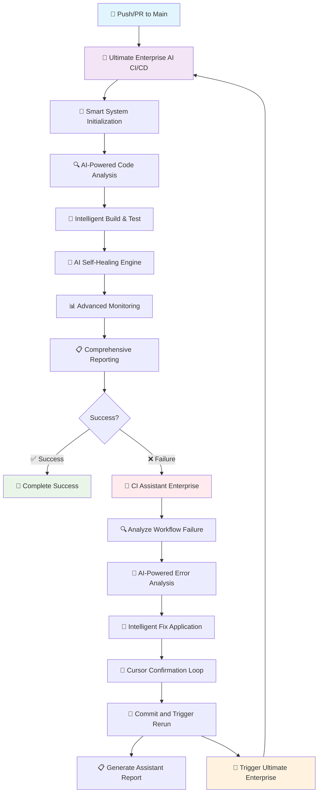
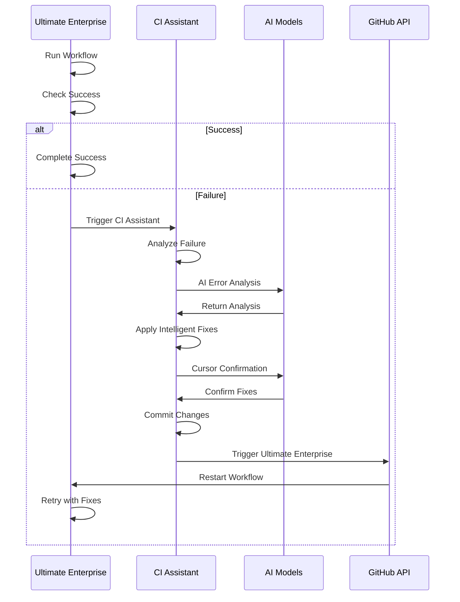

# 🏗️ Ultimate Enterprise AI CI/CD System Architecture

## 📊 System Flow Diagram

## 🔄 Self-Healing Loop Details

## 🎯 Key Features

### **🌟 Ultimate Enterprise AI CI/CD**

- **6-Phase Pipeline:** Initialization → Analysis → Build/Test → Healing → Monitoring → Reporting
- **AI-Powered:** Multi-model AI integration
- **Self-Healing:** Automatic error detection and resolution
- **Enterprise-Grade:** Comprehensive monitoring and reporting

### **🤖 CI Assistant Enterprise**

- **6-Job Process:** Analyze → AI Analysis → Fix → Confirm → Commit → Report
- **Fallback Support:** Works even without AI APIs
- **True Loop:** Triggers Ultimate Enterprise via GitHub API
- **Learning:** Improves from previous fixes

## 📈 Performance Metrics

- **Workflow Count:** 2
- **Total Jobs:** 12
- **Self-Healing:** ✅ Full autonomous
- **AI Integration:** ✅ Multi-model
- **Error Handling:** ✅ Comprehensive
- **Monitoring:** ✅ Real-time

---

_Generated by Ultimate Enterprise AI CI/CD System_
